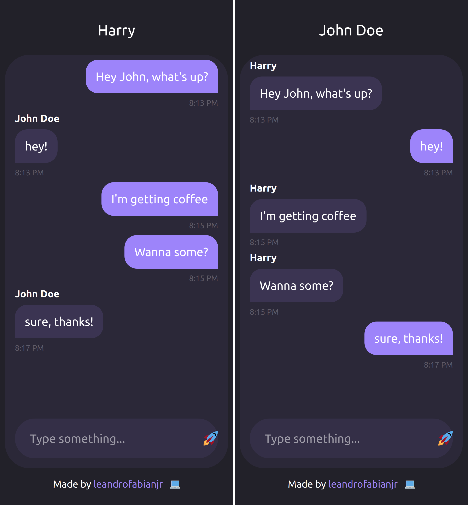

# Chat with PHP Websocket

Simple chat app with PHP e JS.

It implements a websocket using the PHP library [cboden/ratchet](https://github.com/ratchetphp/Ratchet)
and [JS WebSocket API](https://developer.mozilla.org/en-US/docs/Web/API/WebSocket).



## Running locally

Cloning the repository:

```bash
git clone https://github.com/leandrofabianjr/php-js-websochet-chat.git
cd php-js-websochet-chat
```

Installing dependencies:

```bash
# If you have docker
docker run -it -v ${PWD}:/app composer

# If you have composer
composer install
```

Starting the application:

```bash
# If you have docker
docker-compose up --build
```

Starting the server:

```bash
docker exec -t chat /usr/local/bin/php /var/www/html/server/server.php
```

Open http://localhost in your favorite web browser and type something.

## Credits

Design inspired by a [beautiful chat concept](https://dribbble.com/shots/7941890-Messaging-app-concept)
made by [Fahime Rafiee](https://dribbble.com/fahimerafiee) on [Dribbble](https://dribbble.com/).
